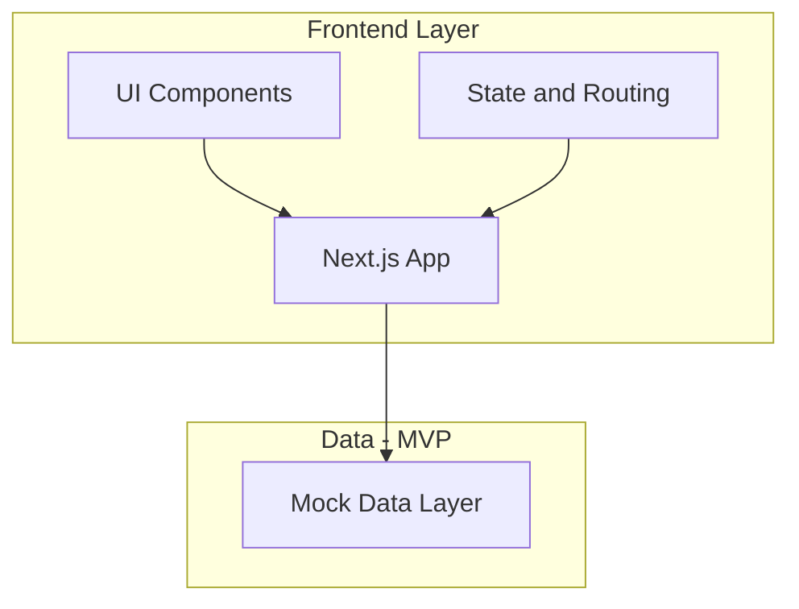
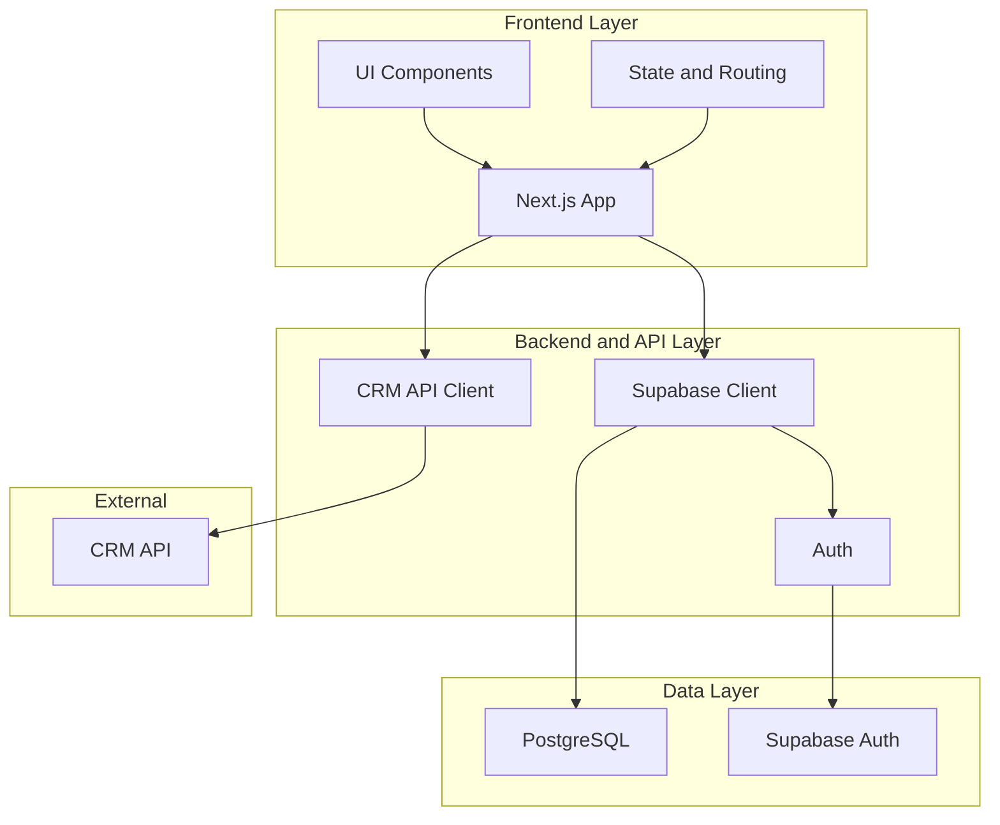

# Product Requirements Document: Client Reporting Tool

**Reference:** Web app for financial advisors to present client financial data in a story-like manner. POC: [Financial Advisor Presentation Tool - Portfolio Dashboard](https://claude.ai/public/artifacts/4bbcd728-27d1-4976-bf43-b37c6237473e).

**MVP approach:** The advisor does not build the deck. All screens are pre-built as a default view. Customizing slides is a future consideration; for MVP, screens are built for the advisor. **MVP data:** The MVP uses mock data (in-code or static JSON) for the client list and per-client presentation data so the full flow can be built and validated without external services. **Later:** The app will connect to Supabase (auth, persistence) and to a CRM via API (real client and portfolio data) at a later date; those integrations are out of scope for MVP.

---

## 1. Executive Summary

### Primary Value Propositions

- **Better client meetings:** Advisors walk clients through financial data in a clear, narrative order (MVP: with mock data; later: real-time data from the CRM) instead of jumping between spreadsheets or static PDFs.
- **Data as story:** Portfolio snapshots, allocations, and performance are shown in a guided, pre-built story. MVP: mock data; later: from CRM.
- **No deck building:** Advisors select a client and present; screens are pre-built. MVP: data from mock source; later: tool pulls from CRM via API.
- **Stronger advisor-client communication:** Shared focus on one screen with step-by-step flow improves clarity and reduces confusion.
- **Differentiation:** Presentation-style experience instead of static reports or manually built decks; CRM integration when connected later.

### Strategic Alignment

- Supports advisor productivity (no deck building; select client and present with live CRM data).
- Improves client experience (clearer explanations, more engaging meetings, always current data).
- Enables firm consistency and scalability via a single, default screen set and CRM as source of truth.

### Core Benefits

- **Advisors:** No prep time building decks; select client and present. Real-time data from CRM; pre-built screens ensure consistent flow.
- **Clients:** Clearer understanding of their financial picture and recommendations; data is current.
- **Firms:** Consistent messaging via default screens; CRM remains source of truth; scalable client review process.

### Success Definition

- Advisors use the tool for live or remote client meetings.
- Positive feedback on clarity and professionalism of presentations.
- Measurable reduction in meeting prep (no deck building); advisors run presentations with live CRM data.

---

## 2. Scope Definition

### In Scope

1. **Mock data (MVP):** Client list and per-client presentation data are supplied by mock data (e.g. in-code or static JSON files). No Supabase or CRM API connection in MVP; this allows the full select-client-and-present flow to be built and tested.
2. **Pre-built default screens:** A fixed set of presentation screens (e.g. overview, allocation, performance) built as the default view. The advisor does not build or customize slides in MVP.
3. **Client selection and presentation mode:** Advisor selects a client from the (mock) client list, launches the default presentation, and walks through pre-built screens with data from the mock data source.
4. **Presentation mode (walk-through):** Full-screen, step-by-step advance/back with optional speaker notes; data on each screen comes from the mock data for the selected client.
5. **Advisor-facing UI only (MVP):** All usage is by advisors; no client self-service or client login in MVP.

### Out of Scope

1. **Presentation builder / custom slides in MVP:** Advisors do not add, remove, reorder, or edit slides in MVP. Customizing slides is a future consideration.
2. **Trading or execution:** No order entry, rebalancing, or trade management.
3. **Full CRM:** The app consumes CRM data via API; it does not replace CRM contact, pipeline, or activity management.
4. **Client portal login:** Clients do not log in to view reports in MVP.
5. **Regulatory compliance automation:** No automated compliance workflows or attestations; advisors remain responsible for compliance.

### Future Considerations

- **Connect to Supabase:** Add Supabase for authentication and persistence (profiles, optional CRM config, cache) in a post-MVP phase.
- **Connect to CRM API:** Replace mock data with real CRM API integration; pull client list and per-client data from the advisor's CRM in real time.
- **Customizing slides:** Allow advisors to customize which screens appear, order, or narrative text (Phase 2+).
- Integrations with additional custodians or data providers beyond the primary CRM API.
- White-label branding and firm-specific theming.
- Client-facing view-only links (e.g. read-only presentation URL).
- Template library or configurable screen sets.

---

## 3. Target Market & User Analysis

### 3.1 Ideal Customer Profile (ICP)

**Company Characteristics**

- Registered Investment Advisors (RIAs) and advisory teams.
- Team size: solo to mid-size (e.g. 2-20 advisors); some multi-office firms.
- AUM band: from tens of millions to low billions; focus on firms that run structured client reviews.
- Geography: US-first; English-language.

**Technology Profile**

- Existing tools: CRM (primary source of client and portfolio data), portfolio management, document storage, video calls for client meetings.
- Integration expectations: the app connects to the CRM via API; client list and presentation data are pulled from the CRM in real time.
- Technical maturity: comfortable with web apps; expect modern, reliable UX; CRM must expose an API the app can call.

**Business Context**

- Pain: manual deck building; data in CRM not easily presented in a story-like way; inconsistent storytelling across advisors.
- Current solutions: slide decks built by hand from CRM exports, static PDFs, or ad hoc screen sharing.
- Budget: willing to pay for tools that save time and improve client experience; CRM API integration is a requirement.
- Decision process: lead advisor or ops lead evaluates; may involve compliance and IT (API access).

**Success Criteria**

- Advisors select a client and present with real-time data from the CRM; no deck building.
- Pre-built screens look professional and support a clear narrative; data is always current from the CRM.
- Tool fits into existing workflow (select client, present during meeting).

### 3.2 User Personas

#### Persona 1: Lead / Relationship Advisor

- **Demographics & Role:** Lead advisor or principal; runs client meetings; 5+ years experience; client-facing and relationship ownership.
- **Goals & Motivations:** Deliver clear, confident client reviews with current data; reinforce trust; no time spent building decks.
- **Pain Points:** Last-minute deck updates; inconsistent storytelling; need to show live data from CRM without manual export.
- **Technical Proficiency:** Comfortable with web apps and presentation tools; prefers simple, predictable flows (select client, present).
- **Usage Patterns:** Selects client from list (from CRM); launches default presentation; walks through pre-built screens during client calls (in-person or remote). Does not build or edit slides in MVP.
- **Decision Influence:** High; often decides which tools the team uses for client meetings; CRM API availability is a gating factor.

#### Persona 2: Associate Advisor

- **Demographics & Role:** Associate or paraplanner; supports lead advisors; may run some client meetings.
- **Goals & Motivations:** Present with accurate, current data from CRM; same experience as lead advisors; no deck prep.
- **Pain Points:** Repetitive manual deck updates when data changes; want to show CRM data in a consistent, story-like format.
- **Technical Proficiency:** Comfortable with web tools; can learn new UIs quickly.
- **Usage Patterns:** Selects client and runs presentation mode; may use same pre-built screens for multiple clients. Does not customize slides in MVP.
- **Decision Influence:** Medium; influences tool choice through daily use and feedback.

#### Persona 3: Operations / Admin (Optional)

- **Demographics & Role:** Operations or admin; manages CRM, integrations, and tool setup.
- **Goals & Motivations:** Connect app to CRM API; ensure advisors see correct clients and data; minimize support burden.
- **Pain Points:** Multiple systems; need reliable API integration and clear mapping between CRM and app.
- **Technical Proficiency:** Varies; may configure API keys, OAuth, or CRM sync settings.
- **Usage Patterns:** One-time or periodic CRM API configuration; troubleshoot connection or mapping issues. Future: manage custom screen sets if that feature is added.
- **Decision Influence:** Low to medium; supports adoption; CRM API access and config often require ops/IT.

---

## 4. User Stories & Acceptance Criteria

### 4.1 Core User Stories

- As an advisor, I want to select a client (from the client list) so that I can present that client's financial data. (MVP: client list is mock data.)
- As an advisor, I want to launch a presentation for the selected client so that I see pre-built screens with data for that client. (MVP: data is mock.)
- As an advisor, I want to present in full-screen with advance and back controls so that I can run the meeting without distractions.
- As an advisor, I want data on each screen to reflect the selected client so that the client sees relevant information without me building a deck. (MVP: data from mock; later from CRM API.)
- As an advisor, I want optional speaker notes on pre-built screens so that I can explain each section consistently.
- As an advisor, I want the same default screens for every client so that I do not spend time building or customizing; I just select client and present. (Customizing slides is a future consideration.)

### 4.2 Detailed User Flows

**Primary Workflows**

1. **Select client and present:** View client list (MVP: from mock data), select a client, launch the default presentation. Pre-built screens load in order; each screen displays data for the selected client (MVP: from mock). Advisor advances through screens (next/previous), optionally views speaker notes, exits presentation mode. (MVP: no sign-in required; optional simple auth or none.)
2. **Data binding:** On entering presentation mode, the app loads client and portfolio data for the selected client; screens render with that data. MVP: data from mock source; later: from CRM API. No advisor-built deck; screens are fixed.
3. **Return to dashboard:** Exit presentation, return to client list or dashboard; can select another client and present again.

**Success Scenarios**

- User sees a client list (mock in MVP) and selects a client; default presentation launches with pre-built screens.
- User completes the present flow and can move through all screens without errors; display is full-screen and readable; data matches selected client.
- User can select a different client and present again with the same default screens and that client's data.

**Edge Cases**

- Client has no or incomplete data: show empty state or placeholder on relevant screens; do not break presenter.
- Large datasets: paginate or aggregate on screens; presentation mode should load first screen in under a few seconds.
- User refreshes during presentation: preserve current screen index where possible; graceful reload. (CRM API unavailable/slow applies when CRM is connected later.)

**Acceptance Criteria (examples)**

- User can see a client list (mock data in MVP).
- User can select a client and launch the default presentation (pre-built screens).
- Data on each screen reflects the selected client (from mock data in MVP).
- User can advance and go back through all screens without errors.
- User can exit presentation mode and return to client list or dashboard.
- No deck building or slide editing in MVP; screens are built for the advisor by default.

---

## 5. Feature Specifications

### 5.1 Feature Hierarchy

| Feature | Priority | Complexity | User Value |
|--------|----------|------------|------------|
| Mock data layer (MVP) | Critical | Simple | Client list and per-client data for MVP; no Supabase or CRM required. |
| Pre-built default screens | Critical | Moderate | Fixed screen set; advisor does not build deck; consistent narrative. |
| Presentation mode (walk-through) | Critical | Moderate | Core value; defines the meeting experience. |
| Client list (mock in MVP) | Critical | Simple | Advisor selects client to present; MVP uses mock list. |
| Presentation launch and data binding | High | Moderate | Launch default presentation for selected client; bind data (mock in MVP) to screens. |
| Supabase connection | Future | Moderate | Auth and persistence; connect at a later date. |
| CRM API integration | Future | Complex | Replace mock with real client/portfolio data from CRM. |
| Customizing slides | Future | Moderate | Phase 2+; allow advisors to customize screens, order, or narrative. |

### 5.2 Detailed Requirements

#### Feature: Mock Data Layer (MVP)

- **Functional Specifications:** Provide client list and per-client presentation data from mock sources (e.g. in-code constants, static JSON files, or a mock API module). Data shape matches what default screens expect so the same components work when Supabase/CRM are added later. No Supabase or CRM API connection in MVP.
- **User Interface Requirements:** Client list and presentation mode work identically from the user's perspective; no UI distinction between mock and real data. Optional dev-only indicator that mock data is in use.
- **Data Requirements:** Mock client list (e.g. id, name, identifier); mock per-client data (e.g. profile, allocation, performance) per screen type; same TypeScript types or interfaces as future CRM API response for easy swap.
- **Business Rules:** MVP runs without external services; data is read-only; designed so swapping in Supabase/CRM later requires minimal UI changes.
- **Integration Points:** None in MVP; data layer abstracted so CRM API or Supabase can replace mock in a later phase.
- **Performance Requirements:** Client list and per-client data load instantly or in under 1 second (local mock).

#### Feature: CRM API Integration (Future)

- **Functional Specifications:** Connect to the advisor's CRM via API; fetch client list and per-client data; replace mock data when connected. To be implemented after MVP; same app screen components consume data from either mock or CRM.
- **User Interface Requirements:** Connection config in settings (e.g. for ops/admin); errors (e.g. CRM unavailable) shown clearly. Not in MVP.
- **Data Requirements:** API contract with CRM; map CRM response to existing app screen models (aligned with mock shape).
- **Business Rules:** Future; auth and credentials when Supabase and CRM are connected.
- **Integration Points:** CRM API; connect at a later date.
- **Performance Requirements:** As in original spec when implemented.

#### Feature: Pre-Built Default Screens

- **Functional Specifications:** A fixed set of presentation screens (e.g. title/overview, allocation, performance, summary) built as the default view. Screens are defined in code or config; order is fixed in MVP. No advisor customization of slides in MVP; future consideration for customizing which screens appear or their order.
- **User Interface Requirements:** Each screen type has a dedicated component; responsive for desktop (tablet optional); handle loading and empty state when CRM data is missing or slow.
- **Data Requirements:** Each screen type expects a defined data shape (same as mock and future CRM API); validation or safe fallbacks when data is partial.
- **Business Rules:** Every presentation uses the same default screen set in MVP; screens are built for the advisor, not by the advisor.
- **Integration Points:** MVP: data from mock layer; later: from CRM API (per selected client). No slide editor or builder in MVP.
- **Performance Requirements:** All default screens render without noticeable lag; support at least 5-10 screen types in default set.

#### Feature: Client List (mock in MVP)

- **Functional Specifications:** Display list of clients; MVP: source is mock data (in-code or static JSON). Advisor selects a client to launch the default presentation. Optional search or filter. Later: replace mock with CRM API or Supabase-synced list.
- **User Interface Requirements:** Client list with optional search or filter; responsive; loading state; selecting a client navigates to presentation launch or directly into presentation mode.
- **Data Requirements:** Client list shape (e.g. id, name, identifier); MVP: from mock; later: from CRM API or Supabase. Use same app client model for mock and real.
- **Business Rules:** MVP: mock list only; no manual client CRUD. Later: CRM or Supabase as source of truth.
- **Integration Points:** MVP: mock data; later: CRM API or Supabase.
- **Performance Requirements:** Client list loads in under 2 seconds (instant with mock).

#### Feature: Presentation Launch and Data Binding

- **Functional Specifications:** When advisor selects a client, launch the default presentation (pre-built screens in fixed order). For each screen, load client/portfolio data for the selected client and render. MVP: data from mock layer; later: from CRM API. No saved "presentation" entity in MVP; no persistence required for MVP.
- **User Interface Requirements:** Clear "Present" or "Launch presentation" action from client list or client detail; transition into presentation mode with first screen loading data for selected client.
- **Data Requirements:** Selected client id; data for that client (mock in MVP; CRM API later); binding of data to each screen component. Same shape for mock and future API.
- **Business Rules:** MVP: no auth required for launch (or minimal); data scoped to selected client. Later: auth and CRM/Supabase.
- **Integration Points:** MVP: mock data; later: CRM API for per-client data.
- **Performance Requirements:** Time to first screen under 2 seconds after client selection (instant with mock).

#### Feature: Presentation Mode (Walk-Through)

- **Functional Specifications:** Full-screen view of one screen at a time; next/previous controls (click and keyboard); optional speaker notes panel or overlay; data on each screen for the selected client (MVP: from mock; later: from CRM API). Exit to client list or dashboard.
- **User Interface Requirements:** Full-screen; minimal chrome; large, readable content; keyboard: arrow keys or space for next, back for previous; focus trap if modal; exit button and shortcut.
- **Data Requirements:** Default screen order; per-screen data for selected client (mock in MVP); optional speaker notes (hard-coded or from config in MVP).
- **Business Rules:** No edit in presentation mode in MVP; data is read-only. MVP: no auth required (or minimal); later: auth when Supabase is connected.
- **Integration Points:** MVP: mock data; later: CRM API for live or cached client data.
- **Performance Requirements:** Time to first screen under 2 seconds; screen transitions under 500 ms.

#### Feature: Customizing Slides (Future)

- **Functional Specifications:** Phase 2+; allow advisors to customize which screens appear, their order, or narrative text. Out of scope for MVP; screens are built for the advisor and data is provided by the CRM API in MVP.
- **User Interface Requirements:** To be defined in Phase 2 (e.g. simple screen picker, reorder, narrative editor).
- **Data Requirements:** To be defined (e.g. user preferences or presentation template stored in app DB).
- **Business Rules:** Future.
- **Integration Points:** Future.
- **Performance Requirements:** N/A for MVP.

---

## 6. Technical Architecture & Implementation

### 6.1 Technology Stack & Architecture Decision

- **Frontend Framework:** Next.js (App Router) with React. Rationale: SSR/SSG for fast loads, single codebase for app and presentation routes, strong ecosystem and alignment with existing UI rules (TypeScript, component-based).
- **MVP data:** Mock data layer (in-code or static JSON). No Supabase and no CRM API in MVP. Rationale: Ship and validate the full select-client-and-present flow without external dependencies; connect Supabase and CRM at a later date.
- **Backend Solution (post-MVP):** Supabase for app auth and optional app data; CRM API client for client and portfolio data. To be added in a later phase.
- **Database (post-MVP):** PostgreSQL via Supabase for profiles, CRM config, cache. Not required for MVP.
- **Authentication (MVP):** Optional: none or minimal (e.g. client-side only or placeholder). Supabase Auth to be connected at a later date.
- **Hosting & Infrastructure:** Vercel (or similar) for Next.js in MVP; add Supabase when connected later. Rationale: Deploy without DB or auth dependencies for MVP.
- **Development Tools:** TypeScript, ESLint, Prettier, Tailwind CSS, shadcn/ui; testing: Vitest (unit), Playwright or Cypress (E2E). Rationale: Consistency with project rules and common practice.

### 6.2 Application Scaffolding & Structure

```
client-reporting-tool/
├── README.md
├── package.json
├── tsconfig.json
├── next.config.js
├── tailwind.config.js
├── .env.local.example
├── public/
│   ├── assets/
│   └── favicon.ico
├── src/
│   ├── app/
│   │   ├── layout.tsx
│   │   ├── page.tsx
│   │   ├── (auth)/
│   │   │   ├── login/
│   │   │   └── signup/
│   │   ├── dashboard/
│   │   ├── clients/
│   │   │   ├── page.tsx
│   │   │   └── [id]/
│   │   │       └── present/
│   │   └── api/
│   │       ├── auth/
│   │       └── crm/
│   ├── components/
│   │   ├── ui/
│   │   ├── layout/
│   │   │   ├── Header.tsx
│   │   │   ├── Sidebar.tsx
│   │   │   └── AppShell.tsx
│   │   └── presentation/
│   │       ├── PresentationMode.tsx
│   │       ├── DefaultScreens.tsx
│   │       └── slide-types/
│   ├── lib/
│   │   ├── data/
│   │   │   ├── mock/
│   │   │   │   ├── clients.ts
│   │   │   │   └── clientData.ts
│   │   │   └── index.ts
│   │   ├── database/
│   │   │   ├── client.ts
│   │   │   └── queries.ts
│   │   ├── auth/
│   │   │   └── utils.ts
│   │   ├── crm/
│   │   │   ├── client.ts
│   │   │   └── types.ts
│   │   ├── utils/
│   │   └── hooks/
│   │       ├── useClients.ts
│   │       └── useClientData.ts
│   ├── types/
│   │   └── index.ts
│   └── styles/
│       └── globals.css
├── database/
│   ├── schema.sql
│   ├── migrations/
│   └── seed.sql
└── docs/
```

**Routing summary**

- `/` – landing or redirect to dashboard/login.
- `/dashboard` – advisor home (client list; no deck building).
- `/clients` – client list (mock data in MVP); `/clients/[id]/present` – launch default presentation for selected client (presentation mode).
- `/login`, `/signup` – auth (optional in MVP; implement when Supabase is connected; can omit or stub for MVP).

No presentation builder or edit routes in MVP; advisor selects client and presents with pre-built screens. MVP uses mock data; Supabase and CRM API connect at a later date.

### 6.3 Database Schema Design

**MVP:** No database required. Client list and per-client data come from mock data (in-code or static JSON). No Supabase connection in MVP.

**When Supabase is connected (later date):** Use the schema below for profiles, CRM connection config, and optional cache. Client list and per-client data may then be fetched from CRM API or synced to Supabase; default screens remain in code.

```sql
-- Advisors (extends Supabase auth.users via id)
CREATE TABLE profiles (
  id UUID PRIMARY KEY REFERENCES auth.users(id) ON DELETE CASCADE,
  email VARCHAR(255) NOT NULL,
  full_name VARCHAR(255),
  created_at TIMESTAMPTZ DEFAULT NOW(),
  updated_at TIMESTAMPTZ DEFAULT NOW()
);

-- Optional: CRM connection config (per-user or per-org); credentials stored securely
CREATE TABLE crm_connections (
  id UUID PRIMARY KEY DEFAULT gen_random_uuid(),
  owner_id UUID NOT NULL REFERENCES profiles(id) ON DELETE CASCADE,
  provider VARCHAR(50) NOT NULL,
  config JSONB NOT NULL DEFAULT '{}',
  created_at TIMESTAMPTZ DEFAULT NOW(),
  updated_at TIMESTAMPTZ DEFAULT NOW()
);

-- Optional: cache of client list or per-client data for performance (TTL or refresh on demand)
-- Omit if all data is always fetched from CRM API on demand
CREATE TABLE client_data_cache (
  id UUID PRIMARY KEY DEFAULT gen_random_uuid(),
  owner_id UUID NOT NULL REFERENCES profiles(id) ON DELETE CASCADE,
  crm_client_id VARCHAR(255) NOT NULL,
  data JSONB NOT NULL DEFAULT '{}',
  fetched_at TIMESTAMPTZ DEFAULT NOW(),
  UNIQUE(owner_id, crm_client_id)
);

-- Row Level Security
ALTER TABLE profiles ENABLE ROW LEVEL SECURITY;
ALTER TABLE crm_connections ENABLE ROW LEVEL SECURITY;
ALTER TABLE client_data_cache ENABLE ROW LEVEL SECURITY;

CREATE POLICY "Users can read own profile" ON profiles FOR SELECT USING (auth.uid() = id);
CREATE POLICY "Users can update own profile" ON profiles FOR UPDATE USING (auth.uid() = id);

CREATE POLICY "Users can manage own crm connections" ON crm_connections FOR ALL USING (auth.uid() = owner_id);

CREATE POLICY "Users can manage own cache" ON client_data_cache FOR ALL USING (auth.uid() = owner_id);

-- Indexes
CREATE INDEX idx_crm_connections_owner ON crm_connections(owner_id);
CREATE INDEX idx_client_data_cache_owner ON client_data_cache(owner_id);
CREATE INDEX idx_client_data_cache_crm_client ON client_data_cache(owner_id, crm_client_id);
```

**Seed data (when Supabase is used)**

- One or two profile rows linked to test auth users.
- Optional: mock CRM connection or env-based CRM API URL for development.

**Migration strategy**

- Apply when Supabase is introduced (post-MVP). Use Supabase migrations or a migration runner; version schema changes. If Phase 2 adds customizable presentations/slides, add tables then.

### 6.4 API Design & Endpoints

**MVP**

- **Data access:** Client list and per-client data are read from the mock data layer (e.g. `lib/data/mock/` or in-memory). No Supabase or CRM API. Can expose optional Route Handlers that return mock data (e.g. `/api/clients`, `/api/clients/[id]`) so the same client code can later call real APIs.
- **Auth:** No Supabase Auth in MVP; routes may be public or use a placeholder. Add auth when Supabase is connected.

**When Supabase is connected (later)**

- Profiles: GET, PATCH (own); auth required.
- CRM connections (optional): GET, POST, PATCH for config; auth required.
- Client data cache (optional): GET, invalidate; auth required.

**When CRM API is connected (later)**

- List clients: fetch client list from CRM API (or proxy via `/api/crm/clients`).
- Get client data: fetch per-client data for presentation (or proxy via `/api/crm/clients/[id]`).
- Request/response shapes align with mock data types so UI code is unchanged. CRM API authentication: OAuth or API key; handle token refresh and errors.
- Rate limiting: respect CRM API limits; optional caching.

### 6.5 System Architecture Diagram

**MVP architecture**



**Post-MVP (when Supabase and CRM are connected)**



---

## 7. Detailed Task Breakdown & Planning

### 7.1 Development Tasks by Category

#### Infrastructure & Setup Tasks

| ID | Name | Description | Acceptance Criteria | Dependencies | Effort | Skills | Priority |
|----|------|-------------|---------------------|--------------|--------|--------|----------|
| INF-1 | Repo and tooling | Initialize Next.js, TypeScript, Tailwind, ESLint, Prettier | Project runs; lint/format pass | None | S | Full-stack | Critical |
| INF-2 | Mock data layer | Add mock client list and per-client data (in-code or static JSON); same shape as future CRM/screen types | Client list and per-client data available; types align with screen components | INF-1 | S | Frontend/Full-stack | Critical |
| INF-3 | Supabase project (post-MVP) | Create project; configure env vars | Deferred; apply when connecting Supabase at a later date | None | XS | DevOps | Future |
| INF-4 | Auth and DB (post-MVP) | Supabase Auth and schema/RLS when Supabase is connected | Deferred; apply when connecting Supabase at a later date | INF-3 | M | Backend | Future |

#### Frontend Development Tasks

| ID | Name | Description | Acceptance Criteria | Dependencies | Effort | Skills | Priority |
|----|------|-------------|---------------------|--------------|--------|--------|----------|
| FE-1 | Layout and shell | App shell, nav, dashboard home | Shell and nav work; dashboard shows placeholder | INF-1 | M | Frontend | High |
| FE-2 | Client list (mock) | List clients from mock data; select client to present | Client list loads from mock; select launches present | INF-1, INF-2 | M | Frontend | Critical |
| FE-3 | Pre-built default screens | Implement default screen set (e.g. overview, allocation, performance) | Each screen type renders with mock data; fixed order | FE-2, INF-2 | L | Frontend | Critical |
| FE-4 | Presentation mode | Full-screen, next/previous, optional notes, exit; data from mock | Meets presentation mode spec; keyboard works; data bound from mock | FE-2, FE-3 | M | Frontend | Critical |
| FE-5 | Responsive and a11y | Responsive layout; ARIA and keyboard | Meets a11y basics; usable on tablet | FE-1 through FE-4 | M | Frontend | High |

#### Backend Development Tasks (MVP)

| ID | Name | Description | Acceptance Criteria | Dependencies | Effort | Skills | Priority |
|----|------|-------------|---------------------|--------------|--------|--------|----------|
| BE-1 | Data abstraction | Expose client list and per-client data via a single data layer (mock implementation for MVP) | Hooks or API return mock data; same interface as future CRM/Supabase | INF-2 | S | Full-stack | Critical |

#### Backend Development Tasks (Post-MVP)

| ID | Name | Description | Acceptance Criteria | Dependencies | Effort | Skills | Priority |
|----|------|-------------|---------------------|--------------|--------|--------|----------|
| BE-2 | Supabase connection | Add Supabase project; auth; schema and RLS | Auth and optional persistence when Supabase is connected | INF-3, INF-4 | M | Backend | Future |
| BE-3 | CRM API client | Connect to CRM via API; list clients; fetch per-client data; replace mock | Same interface as mock; real data from CRM | BE-2 | L | Backend | Future |

#### Quality Assurance Tasks

| ID | Name | Description | Acceptance Criteria | Dependencies | Effort | Skills | Priority |
|----|------|-------------|---------------------|--------------|--------|--------|----------|
| QA-1 | Unit tests | Components and utils; mock data in tests | Coverage for critical paths | FE-3, FE-4, BE-1 | M | QA/Dev | High |
| QA-2 | E2E: select client and present | E2E for client list and presentation mode with mock data | E2E passes for select client and present flow | FE-2, FE-4 | M | QA | High |
| QA-3 | Data layer and security | Mock data layer works; no external deps required for MVP | App runs without Supabase or CRM | BE-1 | S | QA | Medium |

### 7.2 Impact-Effort Matrix Analysis

**Quick Wins (High Impact, Low Effort)**

- Mock data layer: unblocks full flow without Supabase or CRM. Effort: S.
- Presentation mode shell (full-screen, next/back): defines experience. Effort: M.
- Pre-built default screen set (fixed order): no builder; screens built for advisor. Effort: M.
- Client list from mock data: unblocks select-and-present flow. Effort: S.

**Major Projects (High Impact, High Effort)**

- Full default screen set and data binding to mock: core to MVP. Effort: L.
- (Post-MVP) Supabase connection and CRM API integration: deferred. Effort: L.

**Fill-In Tasks (Low Impact, Low Effort)**

- Theming and branding tweaks. Effort: XS-S.
- Keyboard shortcuts in presenter. Effort: S.
- Optional client data cache for performance. Effort: M.

**Avoid / Reassess (Low Impact, High Effort)**

- Presentation builder or slide customization in MVP: out of scope; Phase 2+.
- Custom real-time sync beyond CRM API: avoid unless required.

---

## 8. Implementation Roadmap

### 8.1 Phase Planning

#### Phase 1: Foundation (MVP)

- **Duration estimate:** 6-10 weeks (single full-stack developer or small team).
- **Core features:** Mock data layer (client list and per-client data); pre-built default screens (fixed set and order); client list from mock data; presentation mode (select client, launch default presentation, full-screen advance/back, optional speaker notes); data on screens from mock data. No Supabase and no CRM API in MVP. No deck building; screens are built for the advisor. Auth optional (none or minimal for MVP).
- **Success criteria:** A user can see a client list (mock), select a client, launch the default presentation, and run through all pre-built screens with mock data for that client without errors. App runs without external services.
- **Resource requirements:** One full-stack developer (or frontend + backend); design support for UI/UX. No CRM or Supabase access required.
- **Key deliverables:** Deployable app; mock data layer and data types (aligned with future CRM/screen shape); default screen set; README and env docs; basic E2E for select client and present.

#### Phase 2: Connect Supabase and Optional Enhancements

- **Duration estimate:** 4-8 weeks after Phase 1.
- **Core features:** Connect to Supabase (auth, profiles, optional persistence); apply database schema and RLS when Supabase is introduced. Optional: customizing slides; additional screen types; basic branding/theming.
- **Success metrics:** Auth and persistence working; app ready for CRM API integration or continued use with mock + Supabase.

#### Phase 3: Connect CRM API and Scale

- **Duration estimate:** Ongoing.
- **Core features:** Replace or supplement mock data with CRM API integration; real client list and per-client data from CRM. Optional: multi-tenant or org model; roles; additional data providers.
- **Client share:** View-only link for clients (no login).
- **Analytics:** Usage metrics (presentations run per advisor, client list usage) for product and success tracking.

### 8.2 Risk Management & Dependencies

- **MVP:** No dependency on Supabase or CRM API; mock data removes external risk for Phase 1.
- **Cross-phase:** Phase 2 (Supabase) and Phase 3 (CRM API) depend on stable Phase 1 UI and data layer interface; mock data shape should match future CRM/screen contract so swap is straightforward.
- **External (post-MVP):** When connecting Supabase and CRM API, availability and data contract matter; document expected shapes and isolate data access behind a single layer.
- **Mitigation:** Keep data layer abstract (e.g. `getClients()`, `getClientData(id)`); MVP uses mock implementation; later add Supabase and CRM implementations without changing UI code.

---

## 9. Success Metrics & KPIs

### 9.1 Business Metrics

- **Revenue impact:** Not primary in MVP; later: retention and expansion if monetized.
- **Customer metrics:** Number of advisors using the product; number of firms; retention (logins over time).
- **Operational efficiency:** Time saved per presentation (self-reported or estimated from usage).
- **Market position:** Feedback on differentiation vs. static PDFs and manual decks.

### 9.2 Product & User Metrics

- **Adoption:** Active advisors (e.g. used in last 30 days); presentations run per advisor per month (select client and present).
- **Feature usage:** Client list usage; presentation mode sessions; default screens viewed. (CRM API success rate when CRM is connected later.)
- **User experience:** Completion rate for "select client and present" flow; support tickets and feedback on clarity and reliability.

### 9.3 Technical Metrics

- **Performance:** Time to first slide in presentation mode (target under 2 s); slide transition time; client list load time.
- **Reliability:** Error rate (e.g. 4xx/5xx); uptime target (e.g. 99%+).
- **Security:** MVP: no high/critical vulnerabilities; minimal or no auth. When Supabase is connected: no RLS bypasses; auth required on sensitive operations.

### 9.4 Measurement Framework

- **Baseline:** 0 users and 0 presentations at launch.
- **Targets (example, 6 months):** N active users/advisors (e.g. 10-50); M presentations run per month (e.g. 20-100); presentation mode used when user selects a client. (CRM API success rate when CRM is connected.)
- **Data collection:** MVP: optional client-side or app logs; when Supabase is connected: server-side usage; optional product analytics (privacy-compliant).
- **Reporting:** Monthly review of adoption and performance metrics; owner: product or eng lead.
- **Action triggers:** Error rate above X%; time to first slide above 3 s; drop in weekly active advisors by more than Y%.

---

## 10. Quality Assurance & Testing Strategy

### 10.1 Testing Approach

- **Unit testing:** Critical components (default screen types, client list, presentation mode, utils, mock data layer); Vitest (or Jest). MVP: no Supabase or CRM to mock; use in-code mock data. When Supabase/CRM are added: mock those in tests.
- **Integration testing:** MVP: data layer with mock; when Supabase is connected: API/database layer (queries, RLS) via test DB or Supabase local; auth flows.
- **User acceptance / E2E:** Select client (mock data in MVP) and run presentation mode end-to-end; Playwright or Cypress; run in CI on main.
- **Performance testing:** Load presentation with default screens; measure time to first screen and transition time; fix regressions.
- **Security testing:** MVP: minimal (no auth or minimal). When Supabase is connected: verify RLS and auth on sensitive routes.

### 10.2 Quality Gates

- **Code quality:** ESLint and Prettier on commit or PR; no critical lint errors; consistent formatting.
- **Test coverage:** Minimum 70% on lib and critical components; when Supabase is connected: 100% on auth and RLS-critical paths where feasible.
- **Performance:** Time to first screen under 2 s (p95); screen transition under 500 ms in normal conditions.
- **Security:** No high/critical vulnerabilities in dependencies; when Supabase is connected: RLS and auth reviewed for new tables and routes.
- **User experience:** WCAG 2.1 AA for client list and presentation mode (keyboard, focus, contrast); no critical a11y violations in automated checks.

---

*End of PRD. Ready for development, stakeholder alignment, and project planning.*
